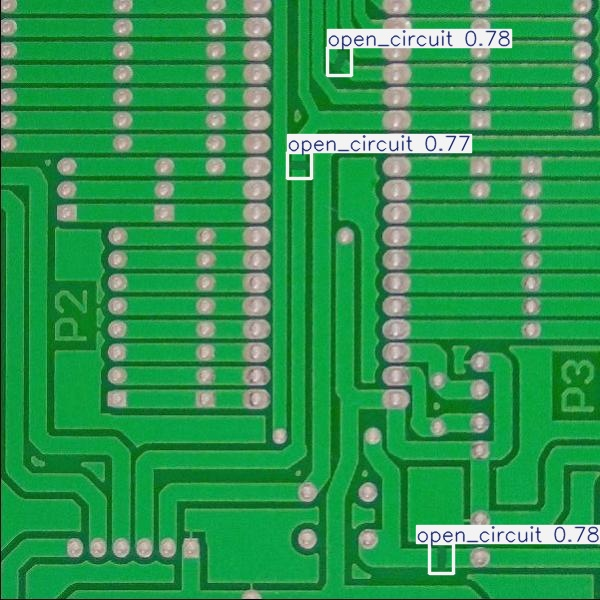
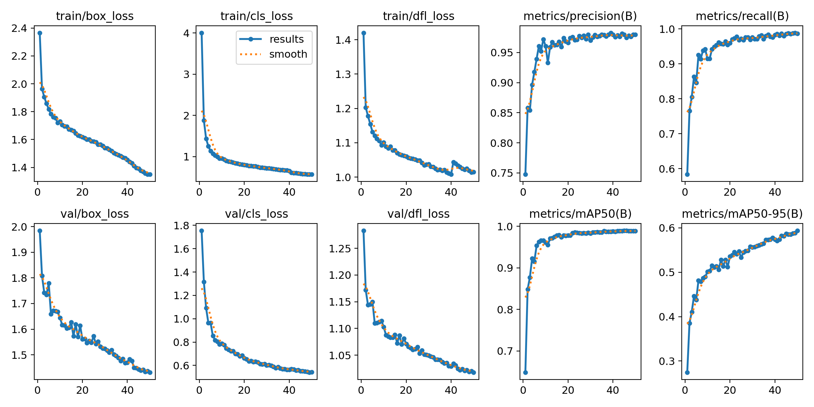

# PCB Defect Detection using YOLOv8

Automated detection of PCB manufacturing defects using transfer learning 
with YOLOv8. Trained on 7,971 annotated PCB images across 6 defect classes.

## Results

| Metric | Score |
|--------|-------|
| mAP50 | 0.989 |
| mAP50-95 | 0.593 |
| Precision | 0.980 |
| Recall | 0.987 |
| Inference speed | 2.4ms/image |

### Per-class performance

| Class | mAP50 |
|-------|-------|
| Missing hole | 0.995 |
| Mouse bite | 0.991 |
| Spurious copper | 0.991 |
| Open circuit | 0.990 |
| Spur | 0.986 |
| Short | 0.982 |

## Example predictions



## Dataset

- Source: Roboflow Universe (TCC PCB Dataset)
- 7,971 images at 600×600 resolution
- Split: 6,346 train / 798 validation / 827 test
- 6 defect classes: missing_hole, mouse_bite, open_circuit, 
  short, spur, spurious_copper

## Model

- Architecture: YOLOv8n (nano) with pretrained COCO weights
- Transfer learning: 319/355 layers transferred from pretrained weights
- Final detection head retrained for 6 classes
- Training: 50 epochs, batch size 16, image size 608×608
- Hardware: NVIDIA Tesla T4 GPU, ~1.6 hours training time

## Approach

Rather than training from scratch, I used transfer learning on YOLOv8n 
pretrained on COCO. The backbone layers already encode general visual 
features (edges, textures, shapes) — only the detection head was retrained 
for PCB-specific defect classes. This allowed strong performance with a 
relatively small dataset.

## Training results

### Loss and mAP curves


### Confusion matrix


## Limitations and future work

**mAP50-95 gap (0.989 → 0.593):** The model scores well at loose IoU 
thresholds but drops significantly at stricter ones, indicating bounding 
box localisation could be improved. A larger model (YOLOv8s or YOLOv8m) 
or custom anchor tuning may help.

**Distribution shift:** The dataset comes from a single PCB 
manufacturer under controlled lighting conditions. Performance on PCBs 
from different manufacturers, camera setups, or lighting environments 
is unknown and likely degraded. This is a known challenge in industrial 
inspection — models trained in one factory often fail in another.

**Class imbalance:** Defect classes have roughly equal representation 
in this dataset, which is unrealistic for real production lines where 
some defects are far rarer than others.

**Edge deployment:** The model weights are 6.2MB — small enough for 
edge deployment on devices like Raspberry Pi or Jetson Nano. Quantisation 
(INT8) could reduce this further for microcontroller deployment.

## How to run
```bash
pip install ultralytics roboflow
```
```python
from ultralytics import YOLO

# Load trained model
model = YOLO('weights/best.pt')

# Run inference on an image
results = model.predict(source='your_pcb_image.jpg', conf=0.25)
```

## Repository structure
```
pcb-fault-vision/
├── train.ipynb
├── README.md
├── weights/
│   └── best.pt
└── assets/
    ├── pcb_defect_detector/
    │   ├── results.png
    │   ├── confusion_matrix.png
    │   ├── PR_curve.png
    │   └── F1_curve.png
    └── test_predictions/
        └── prediction images
```

## Tech stack

Python · YOLOv8 (Ultralytics) · PyTorch · Google Colab (T4 GPU) · Roboflow
